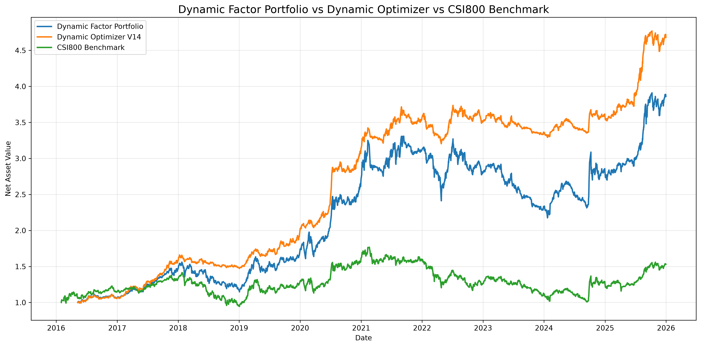
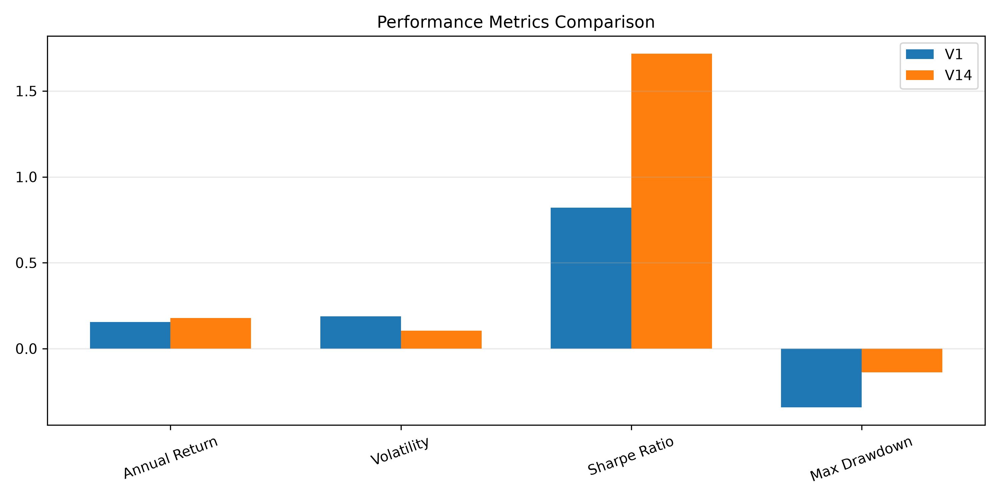
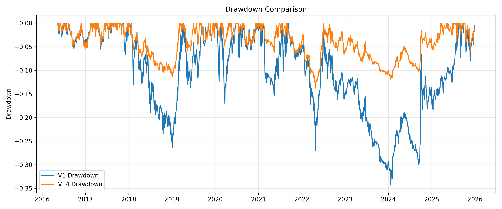
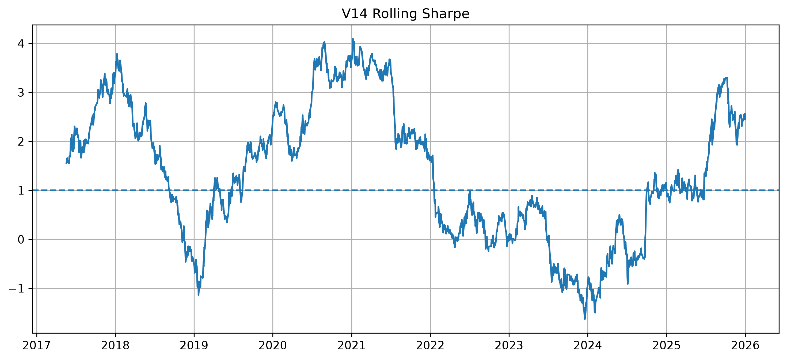
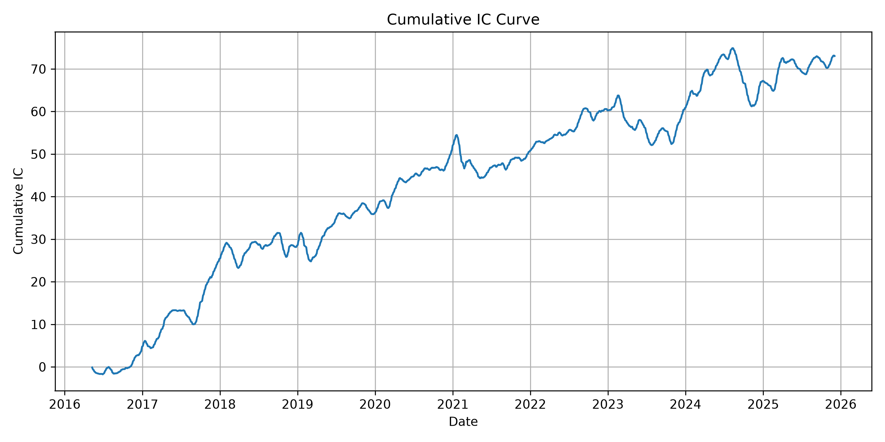
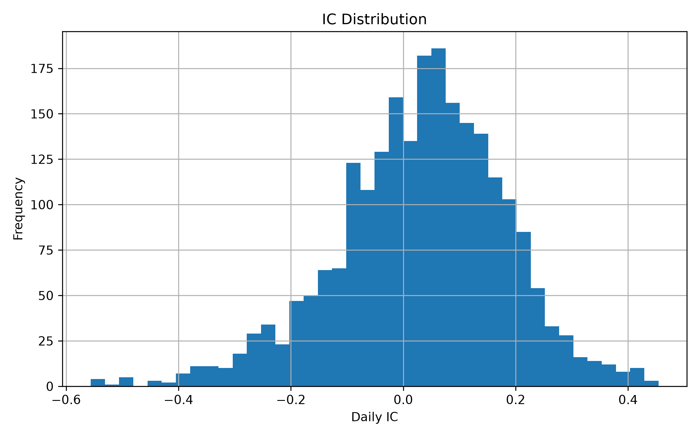
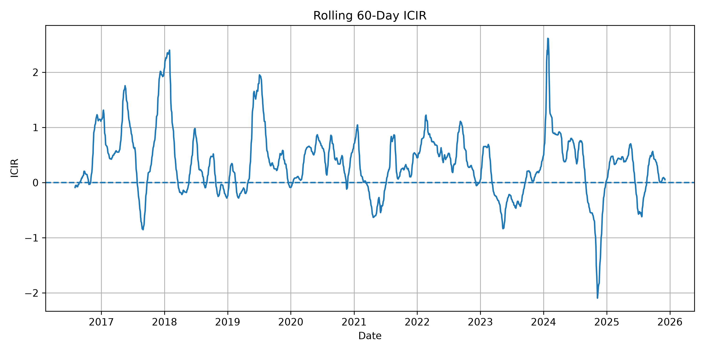

# Dynamic Factor Discovery & Portfolio Optimization

基于 CSI 800 股票池的动态因子选股与组合优化研究项目。

本项目构建了一套完整的量化投资研究流程：

- 多因子构建与因子有效性分析
- 动态 ICIR 因子权重调整
- 动态股票筛选与组合构建
- 风险控制与仓位优化
- 回测分析与策略评价

最终通过动态优化模型提升组合的风险收益表现。


# 1. Project Overview


传统多因子模型通常采用固定因子权重，但市场环境变化会导致因子有效性产生漂移。

本项目构建动态因子投资框架：

1. 基于 CSI800 股票池构建多维因子体系
2. 使用 IC / ICIR 评价因子预测能力
3. 根据历史表现动态调整因子权重
4. 构建动态股票组合
5. 引入风险控制模块优化组合表现


研究目标：

> 构建能够适应市场变化，并在收益与风险之间取得平衡的动态投资组合。


# 2. Research Pipeline


```
Market Data
      |
      v
Data Cleaning
      |
      v
Factor Construction
      |
      v
Factor Evaluation
(IC / ICIR)
      |
      v
Dynamic Factor Weighting
      |
      v
Portfolio Construction
      |
      v
Dynamic Optimizer
      |
      v
Performance Evaluation
```


# 3. Data

项目使用 CSI 800 股票池相关数据：

## BaoStock

用于获取股票历史行情数据：

- 日线行情
- 收盘价、成交量等交易数据
- 股票收益率数据

主要用于：

- 收益计算
- 波动率计算
- 回测分析

## AkShare

用于获取上市公司财务指标：

- 盈利能力指标
- 财务质量指标

主要用于：

- 构建 Quality 因子
- 辅助多因子评分

## Tushare

用于获取中证800指数数据：

- CSI 800 Benchmark

主要用于：

- 基准收益比较
- 超额收益分析

所有数据经过清洗、日期统一和格式转换后用于后续建模。


# 4. Factors

项目基于 CSI 800 股票池构建多因子模型，并通过 ICIR（Information Coefficient Information Ratio）动态调整不同因子的组合权重。

最终模型保留三个核心因子：

## 4.1 Momentum

用于捕捉股票价格趋势和历史收益表现。

主要衡量：

- 历史收益趋势
- 股票价格动量强度

对应标准化因子：

momentum_z


## 4.2 Low Volatility

用于衡量股票风险特征，筛选收益更加稳定的股票。

主要衡量：

- 历史收益波动率
- 收益稳定程度

对应标准化因子：

low_volatility_z


## 4.3 Quality

用于衡量企业基本面质量。

主要衡量：

- 盈利能力
- 财务稳定性
- 企业经营质量

对应标准化因子：

quality_z


三个因子经过 Z-score 标准化后，根据历史 ICIR 表现动态调整权重：

Dynamic Score:

dynamic_icir_score = momentum_z × momentum_z_weight + low_volatility_z × low_volatility_z_weight + quality_z × quality_z_weight


最终生成每日股票动态评分：

dynamic_icir_score


该评分用于后续股票排序、组合构建以及动态优化。


# 5. Factor Evaluation


采用 IC 和 ICIR 评价因子有效性。


主要分析：

- 因子预测能力
- 因子稳定性
- 因子方向有效性

通过滚动 ICIR 衡量因子在不同市场阶段的有效性变化。


输出：

- `ic_summary.csv`
- `factor_direction_check.parquet`
- `rolling_icir_curve.png`


# 6. Strategy Validation

为了进一步验证动态组合评分的有效性，本项目对最终生成的 dynamic_icir_score 进行预测能力分析。

采用横截面 IC 方法计算每日股票评分与未来收益之间的相关性。

评价指标：

- IC Mean
- IC Std
- ICIR
- Positive IC Ratio

最终策略 IC 结果：

| Metric | Value |
| --- | :---: |
| IC Mean | 0.0314 |
| IC Std | 0.1510 |
| ICIR | 0.2079 |
| Positive IC Ratio | 60.46% |

同时绘制累计 IC 曲线和滚动 ICIR 曲线，用于观察策略预测能力稳定性。


# 7. Dynamic Factor Weighting


相比固定权重模型，本项目根据因子历史表现动态调整权重。


核心思想：

```
Factor Weight ∝ Historical ICIR Performance
```


流程：

```
Factor Score
      |
      v
ICIR Evaluation
      |
      v
Dynamic Weight Update
      |
      v
Portfolio Score
```


# 8. Portfolio Construction


每月最后一个交易日按照 dynamic_icir_score 对 CSI800 股票进行横截面排序，选择 Top 100 股票构建等权投资组合。

主要步骤：

1. 股票动态评分排序
2. 选择高评分股票
3. 平均分配权重
4. 计算组合收益


组合特点：

- CSI800股票池
- 动态选股
- 权重归一化


# 9. Dynamic Optimizer

本项目采用迭代式量化研究流程，模型通过 V1-V14 多版本迭代优化逐步演进，每个版本在统一回测框架下比较风险收益指标，最终选择综合表现最佳的 V14 策略。

初始版本基于静态多因子评分模型，随后逐步引入以下主要优化方向：

## Volatility Targeting

根据历史实现波动率动态调整投资暴露，使组合风险水平接近目标波动率。

## Drawdown Control

基于组合历史最大回撤状态识别风险压力，在极端回撤环境下降低风险暴露。

## Trend Filter

结合短中期趋势信号判断市场状态，动态调整组合风险偏好。

## Dynamic Exposure Adjustment

综合多元信息，生成动态仓位系数，实现风险暴露自适应调整。

不同版本通过统一回测框架进行评估，并根据收益、波动率、夏普比率和最大回撤等指标持续优化。

最终形成 Dynamic Optimizer V14 版本：

- Volatility Targeting
- Drawdown Control
- Trend Filter
- Dynamic Exposure Adjustment


# 10. Performance Evaluation


## V1 vs V14


| Metric | V1 | V14 |
| --- | :---: | :---: |
| Total Return | 2.79 | 3.62 |
| Annual Return | 15.39% | 17.87% |
| Volatility | 18.75% | 10.41% |
| Sharpe Ratio | 0.82 | 1.72 |
| Max Drawdown | -34.25% | -13.77% |


相比初始版本：

- 收益能力提升
- 波动率明显降低
- 最大回撤下降
- Sharpe Ratio 提升


# 11. Benchmark Comparison


将最终策略与 CSI800 Benchmark 进行比较。


评价指标：

- NAV 曲线
- 最大回撤
- 风险收益指标


结果表明：

动态优化策略在回测周期内具有更优的风险调整收益表现。


# 12. Project Structure


```
factor-discovery-portfolio/

├── data/
│   ├── raw/
│   └── processed/
│
├── src/
│   └── factor_discovery_portfolio/
│
├── scripts/
│   ├── build_multifactor_v2.py
│   ├── build_dynamic_portfolio.py
│   ├── evaluate_strategy_ic.py
│   ├── backtest_dynamic_optimizer_v14.py
│   ├── evaluate_performance.py
│   └── plot_final_comparison.py
│
├── reports/
│
├── figures/
│
└── README.md
```


# 13. Environment

项目使用 uv 管理 Python 环境。

Python:

Python >= 3.10

安装依赖：

uv sync


主要依赖：

```
pandas
numpy
scipy
scikit-learn
matplotlib
pyarrow
baostock
akshare
tushare
```


# 14. Running


## Factor Construction

```bash
python scripts/build_multifactor_v2.py
```


## Portfolio Construction

```bash
python scripts/build_dynamic_portfolio.py
```


## Backtest

```bash
python scripts/backtest_dynamic_optimizer_v14.py
```


## Evaluation

```bash
python scripts/evaluate_performance.py

python scripts/plot_final_comparison.py
```


# 15. Outputs


主要结果文件：


```
data/processed/

dynamic_optimizer_v14_result.parquet

dynamic_performance.csv

final_performance_comparison.csv
```


# 16. Visualization


## Strategy Performance Comparison


最终策略、初始策略与基准净值曲线：




## V1 vs V14 Comparison


最终策略与初始策略性能指标对比：




最终策略与初始策略回撤对比：




## Rolling Sharpe Ratio


最终策略滚动夏普比率：




## Strategy IC Analysis

### Cumulative IC Curve


动态因子信号的累计 IC 变化趋势：




### IC Distribution


每日 IC 值的分布情况：




### Rolling ICIR


 60 日滚动 ICIR 变化情况：

